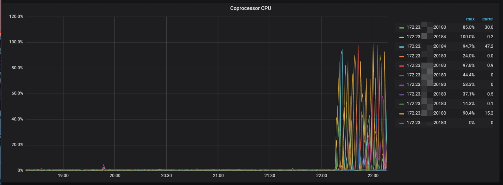
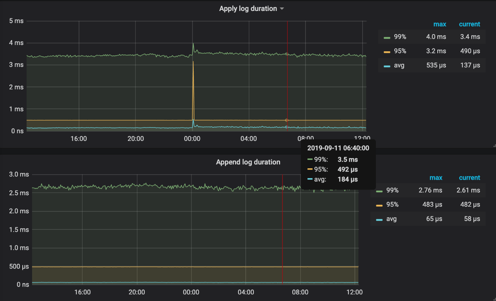

## 现象
集群 Duration 上升，.95 Duration 达到秒级。

## 环境信息收集
### 版本

v3.0.3

## 分析步骤

1. Duration 上升，检查 Overview -> TiDB -> KV Cmd Duration 99 看到对应时间段的 batch_get 和 commit 的 kv 操作 duration 都上升了，达到了秒级

说明 Duration 上升是由于访问 tikv 的 kv 操作慢导致的，接下来就应该排查 tikv 慢的原因。

2. 查看 TiKV-Detail -> Thread CPU 相关监控项，查看 tikv CPU 情况

通过监控可以看到 Raft store CPU 一直比较高（用户设置了 store-pool-size = 4），Duration 上升时间段，Coprocessor CPU 也同样上升了。而且 grpc CPU 占用很高，同时在出问题的时候线程的 CPU 占用有个跳变的情况，之后 CPU 占用最高的那个线程比之前更高。

3. 查看 TiKV-Detail -> Raft IO 相关监控项，查看 tikv 节点的磁盘 IO 情况

查看当时的 Apply log duration 和 Append log duration 看到 Duration 都正常，说明不是 tikv io 问题引起的。

4. 查看 TiKV-Detail -> gRPC 相关监控项，查看 tikv 节点的网络情况

可以看到网络方面总体上也没有什么问题。

5. 推测原因是由于 grpc 线程被占满使用，调整 grpc-concurrency 参数为 6 ，查看结果。

调整完 grpc 线程数之后，延迟下降并稳定了。

6. 排查 grpc cpu 占用高的原因。

向用户了解到，用户在之前调整过 storage-pool-size 参数，从 2 调整到 4。调整之后通过监控看到 grpc cpu 上升。推测是心跳导致的。通过 PD -> Heartbeat -> Region heartbeat report 看到 storage-pool-size 调整前后，heartbeat 翻倍了。

在这个例子中，用户集群单个 TiKV 上 Region 比较多，单个 TiKV Region 数量达到 10 万+，在 storage-pool-size 为 2 的时候，raft store cpu 处理不过来，能够处理并发送出去的 heartbeat 比较少，所以 grpc cpu 比较低，storage-pool-size 调大之后， raftstore 能处理过来了，能够及时处理并发送更多的 heartbeat，所以 grpc cpu 上来了，grpc cpu 称为了瓶颈。 

## 结论
- 单个 TiKV region 数量过多导致 raft store CPU 和 gRPC CPU 线程成为瓶颈。按照官网推荐配置，建议单个 TiKV 承载 Region 数量不要超过 3 万。当单个 TiKV Region 数量超过 5 万（建议值，实际可以按照服务器配置情况决定），3.0 以上版本可以开启 hibernate region 特性降低不活跃 region 的心跳发送频率，降低 tikv 负载
- hibernate region 特性可以参考：https://github.com/tikv/tikv/blob/fa6e6d3eda27e7580a2c2e5ec88a8895d7b4cafb/docs/reference/configuration/raftstore-config.md#hibernate-region

