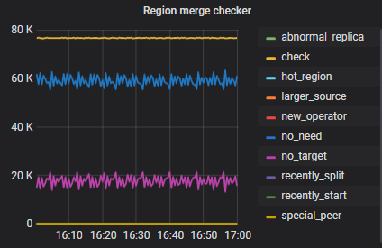

## 现象

TiDB 集群开启 Region Merge 后，无 merge 任务产生且无 Merge

## 环境信息收集

### 版本： v3.0.5

### 背景及现象

- 1st Day： 黑石机房环境，TiDB 版本从 v2.1.15 升级到 v3.0.5，通过 jq 查询及监控 [监控项Region Health，监控指标：empty-region-count，监控值：max：19.55k，avg：19.52k，current：19.55k] 发现 19.5K 空 region，通过 PD control 调整 merge-schedule-limit 8 后，region merge 速度依然很慢。


- 3th Day： 调整 merge-schedule-limit 200 后，观察到 region merge 任务没有创建，没有任何 region merge 操作，监控 [监控项：Schedule operator create]。

#### Region Merge 相关参数设置

```yaml
max-merge-region-size: 20
max-merge-region-keys: 200000
merge-schedule-limit: 200
```

### 分析步骤

- 1. 监控项 PD Dashboard -> Schedule -> Region Merge checker [merge checker 的状态]，确认是否 Region Merge 状态，是否有需要进行 Merge region 操作的 Region，从监控上看，80k 个 Region 均为 no_need 和 no_target 状态，所以不需要进行 Region Merge 操作。



- 2. 确认 TiDB 集群的业务及业务操作：TiDB 集群支撑 10 多个业务模块测试，业务模型包含的 DML 和 DDL 操作多样且复杂，确认 Region 是否存在跨表的场景。
  
### 结论

- 1. 可以适当调整 `merge-schedule-limit` 来加速 merge。另外，merge 的速度和 `max-merge-region-keys`， `max-merge-region-size` 这两个参数没有必然的联系，只检查条件，可以根据集群 region 大小情况调整到一个合适的值。

- 2. merge 默认情况下表之间是不会相互 merge 的，如果要开启，更改 PD 配置文件，最上面加上 `namespace-classifier = "default"` (默认是 table)， 

> **注意：**
>
> 这个参数不能通过 pd-ctl 动态更改。同时，需要将 tikv 的按 table 分裂配置关闭:
>```yaml
>[coprocessor]
>`split-region-on-table = false`
>```

- 3. 目前 v3.0.4 和 v2.1.16 以前的版本， region 的统计 `approximate` 由于 BUG 造成统计有问题，造成 `keys` 很大，可以把 `max-merge-region-keys` 这个条件放开，调到很大的值。

- 4. 如果 `merge opm` 达到 几百～上千 `opm` 依然无法满足，可以调整
`"patrol-region-interval": "100ms"`到 `"patrol-region-interval": "10ms"` ，这个能加快巡检 region 的速度，但是会消耗更多的 CPU。